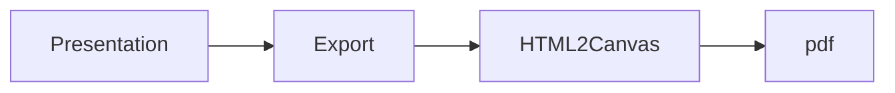

## Table of contents
- [Introduction](#introduction)
- [Features](#features)
- [Schema](#schema) 
- [Notable](#notable)
- [Explanation](#explanation)

## Introduction
This muted and simple presentation (text #FFFFF and background #AEAFF1) serves as an introduction to a project.
## Features
Websites have lost their semantic meaning with an excess of div togs just used for styling. This page uses two div tags. One for the presentation and the other to show a print this button. The button uses a library called [HTML 2 Canvas]([html2canvas](https://html2canvas.hertzen.com/)). Developed by Niklas von Hertzen, the library permits the reader to take "screenshots" of the presentation with Javascript.  
## Schema
a) Web presentation
b) Export to PDF 
c) html2canvas 
d) (insert title).pdf

## Noted code

## Explanation

