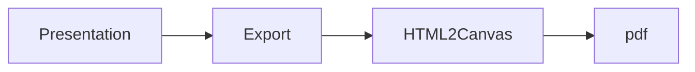

## Introduction
## Features
This is a very simple presentation that uses a library called [HTML 2 Canvas]([html2canvas](https://html2canvas.hertzen.com/)). Developed by Niklas von Hertzen, the library allows you to take "screenshots" of webpages or parts of it, directly on the users browser, with Javascript.  
## Schema
a) Web presentation
b) Export to PDF 
c) html2canvas 
d) (insert title).pdf

## Noted code
## Explanation

